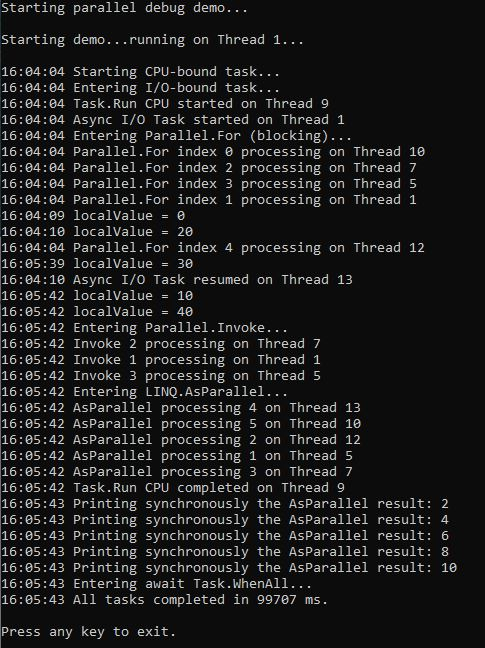
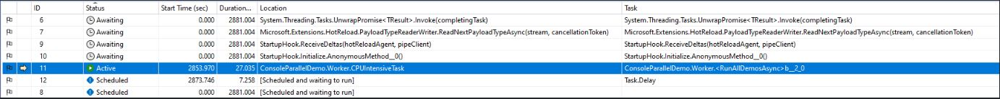
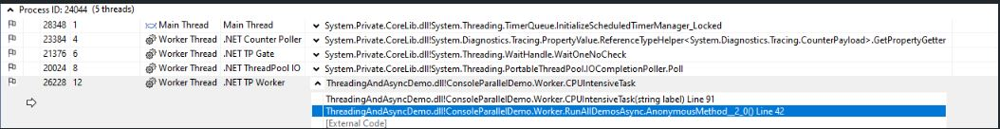
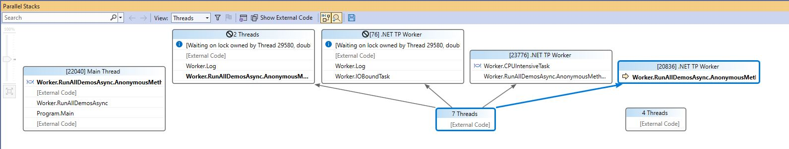
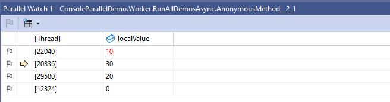

# MultitaskingDebugDemo

This solution demonstrates various parallel programming techniques in C# for use with Visual Studio's **Debug Windows**: Tasks, Threads, Parallel Stacks, and Parallel Watch.

---

## Techniques Used

- `Task.Run`
- `await TaskAsync`
- `Parallel.For`
- `Parallel.Invoke`
- LINQ `.AsParallel()`

---

## Breakpoint Suggestions

Place breakpoints in the following methods to observe parallel behavior:

- `CPUIntensiveTask()`
- `IOBoundTask()`
- `Log()`
- Lambdas in `Parallel.For` and `Parallel.Invoke`
- LINQ `.AsParallel()` query

---

## Output

---

## Debug Windows

### 🔹 Tasks
View active, scheduled, or completed `Task` objects and their IDs.

### 🔹 Threads
Inspect thread pool threads, their IDs, and call stacks.

### 🔹 Parallel Stacks
Visualize how threads are forked and joined during parallel execution.

### 🔹 Parallel Watch
Observe variable values across multiple threads or tasks.

